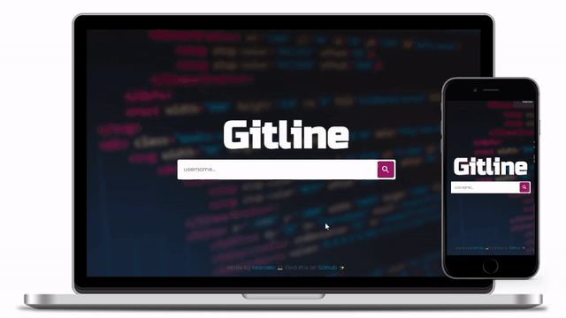

# Gitline

> Your github repositories history beatifuly structured

<p align="start">
	  
	  
	  
	  
	  <a href="https://gitline.web.app">
			
    </a>
</p>

View your github repositories timeline, beatifuly organized and sorted by creation date. Filter them by the main language and share with anyone you want.

## Live

You can find the application live here:
https://gitline.web.app

<h1 align="start">
  
</h1>

## Contributing

This repository is currently under development. If you want to contribute please fork the repository and get your hands dirty, and make the changes as you'd like and submit the Pull request.

## Building

You'll need [Node.js](https://nodejs.org) installed on your computer in order to build this app.

```bash
$ git clone https://github.com/mpirescarvalho/gitline.git
$ cd gitline
$ npm install
$ npm run dev
```

Runs the app in the development mode.<br/>

## Contact

<a href="https://github.com/mpirescarvalho">
  
</a>
<a href="mailto:mpirescarvalho17@gmail.com">
  
</a>
